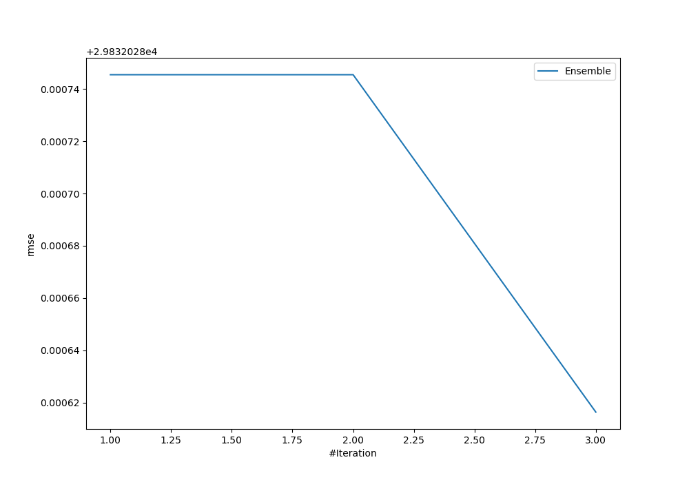
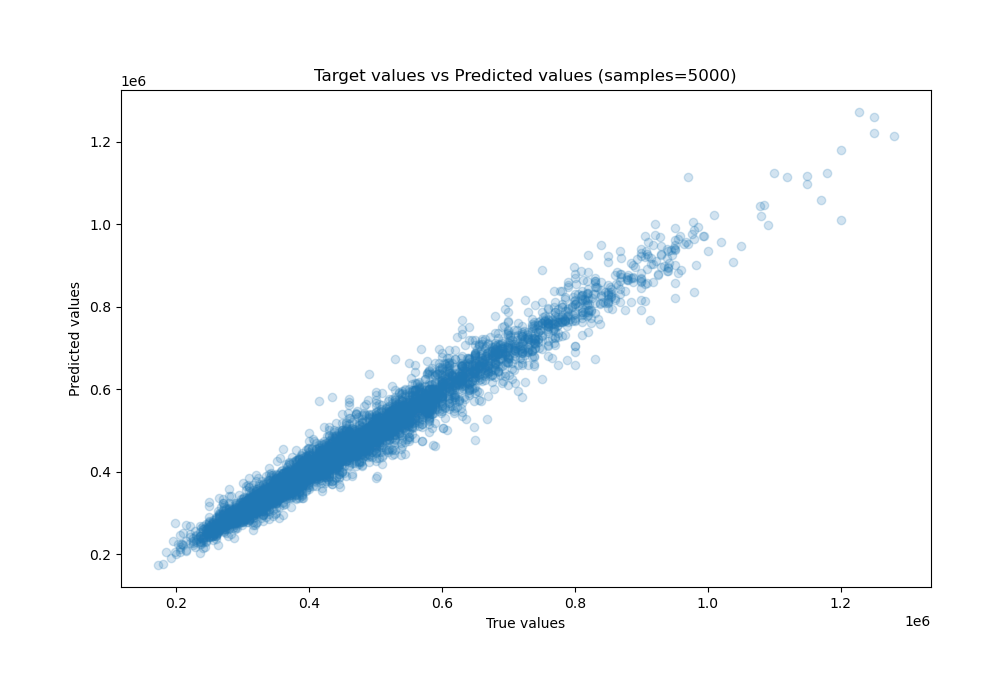

# Summary of Ensemble

[<< Go back](../README.md)

## Ensemble structure
| Model             |   Weight |
|:------------------|---------:|
| 2_Default_Xgboost |        3 |

### Metric details:
| Metric   |          Score |
|:---------|---------------:|
| MAE      | 21377.1        |
| MSE      |     8.8995e+08 |
| RMSE     | 29832          |
| R2       |     0.965211   |
| MAPE     |     0.0452004  |

## Learning curves

## True vs Predicted

## Predicted vs Residuals

[<< Go back](../README.md)
