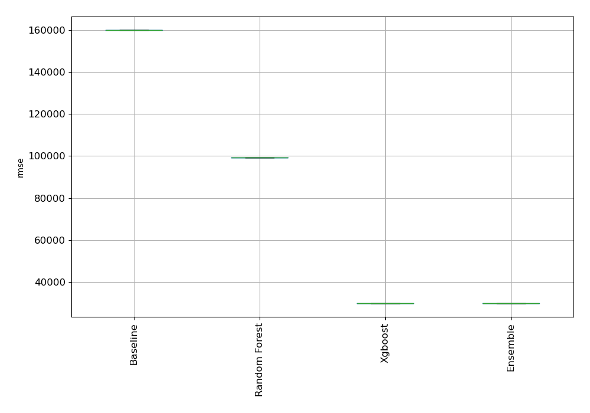
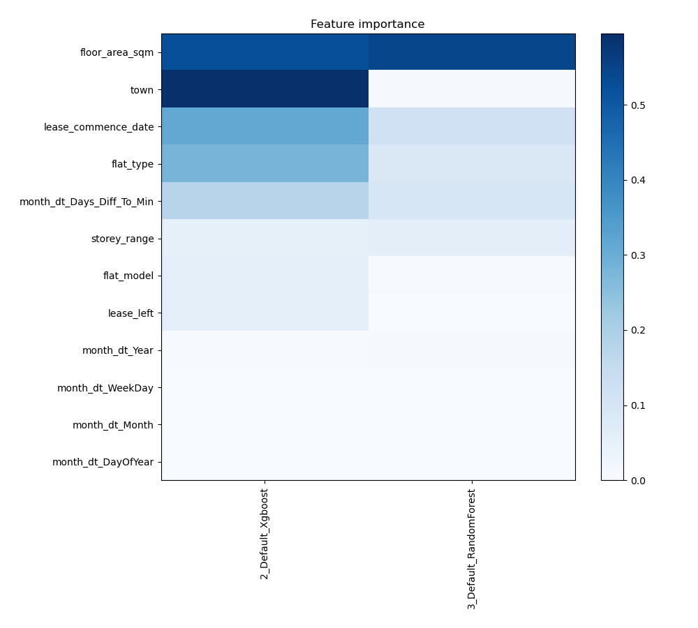
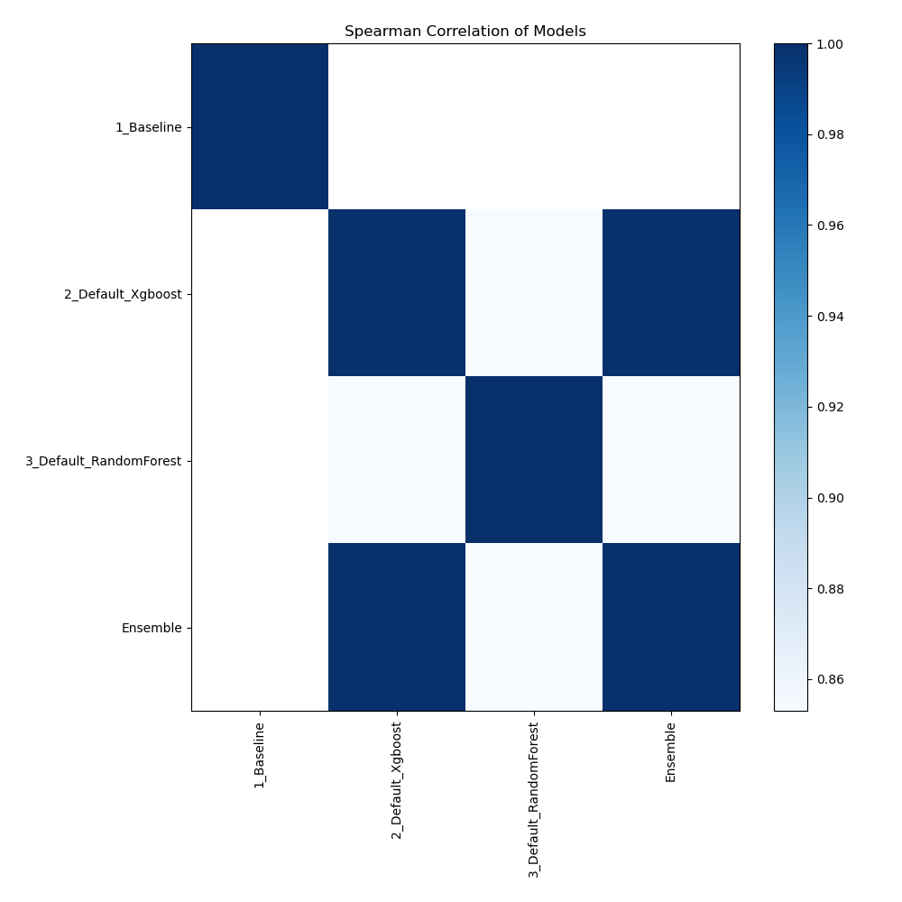

# AutoML Leaderboard

| Best model   | name                                                       | model_type    | metric_type   |   metric_value |   train_time |
|:-------------|:-----------------------------------------------------------|:--------------|:--------------|---------------:|-------------:|
|              | [1_Baseline](1_Baseline/README.md)                         | Baseline      | rmse          |       159943   |         0.48 |
| **the best** | [2_Default_Xgboost](2_Default_Xgboost/README.md)           | Xgboost       | rmse          |        29832   |        40.66 |
|              | [3_Default_RandomForest](3_Default_RandomForest/README.md) | Random Forest | rmse          |        99235.2 |         9.01 |
|              | [Ensemble](Ensemble/README.md)                             | Ensemble      | rmse          |        29832   |         0.05 |

### AutoML Performance

### AutoML Performance Boxplot

### Features Importance

### Spearman Correlation of Models

